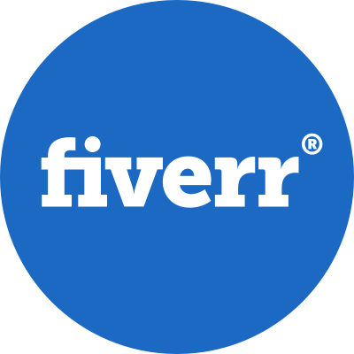

#  Hello World, I'm SUBID DAS

[](https://www.github.com/devsubid)
[](https://twitter.com/devsubid)

[](https://www.github.com/itsme-subid)

## 😀 About Me

```typescript
const aboutMe = {
  name: "SUBID DAS",
  email: "itsmesubid@gmail.com",
  languages: ["TypeScript", "JavaScript"],
  technologies: {
    frontEnd: {
      js: {
        framework: "React.js",
        metaFramework: "Next.js",
        library: "Framer-Motion",
      },
      css: ["Tailwind CSS", "CSS-in-JSS", "Radix UI", "SASS"],
    },
    backEnd: {
      framework: ["tRPC", "Node.js", "Express.js", "Nest.js"],
      orm: ["Prisma", "Mongoose"],
      baas: ["Supabase", "Appwrite", "Firebase"],
    },
    databases: ["PostgreSQL", "MySQL", "MongoDB"],
    misc: {
      serverless: ["Vercel", "Netlify", "Cloudflare"],
      versionControl: ["Git", "GitHub"],
      packageManager: ["pnpm", "yarn", "npm"],
      authentication: ["Next-Auth", "Firebase Auth", "Clerk"],
      codeEditor: ["Visual Studio Code", "Sublime Text", "Vim"],
      design: ["Figma", "Adobe XD", "Photoshop", "InDesign", "Illustrator"],
    },
  },
  currentOccupation: [
    "student, open for internship opportunities",
    "open for freelance work",
  ],
};
```

| Visitors |  |
| -------- | ------------------------------------------------------------ |

## 🏆 GitHub Stats

<a align="center" href="http://github.com/devsubid"></a>
<a align="center" href="https://github.com/devsubid">

</a>

## ✨ Connect with me

<div align="center">
<a href="https://twitter.com/devsubid/" target="blank"></a> &nbsp;&nbsp;&nbsp;
<a href="https://www.linkedin.com/in/devsubid/" target="blank"></a>&nbsp;&nbsp;&nbsp;
<a href="https://www.instagram.com/devsubid/" target="blank"></a>&nbsp;&nbsp;&nbsp;
<a href="https://www.fiverr.com/itsmesubid/" target="blank"></a>
</div>

[](https://github.com/devsubid)
